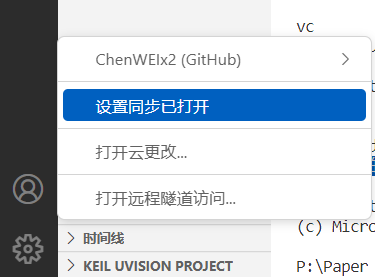
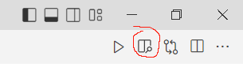
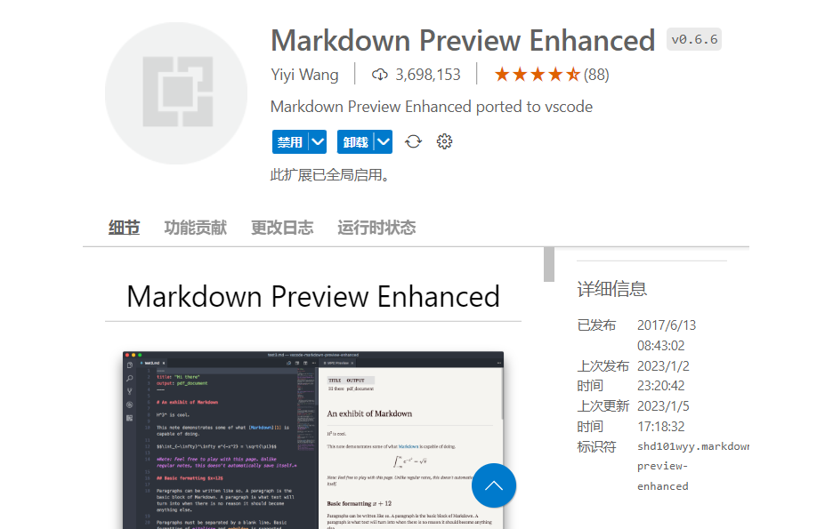
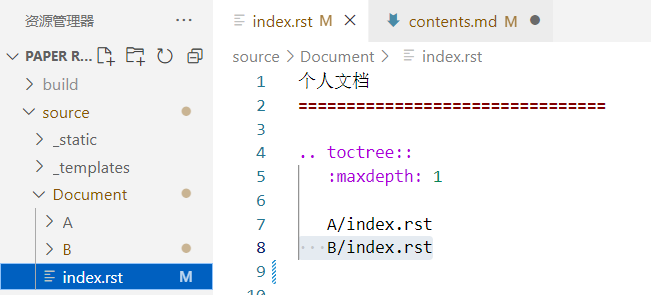
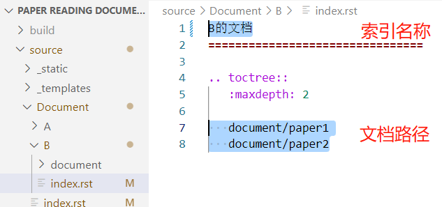
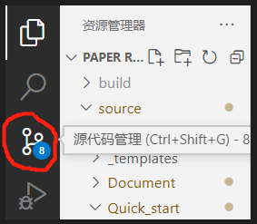
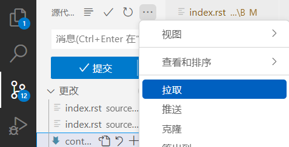
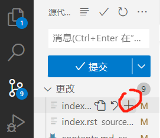
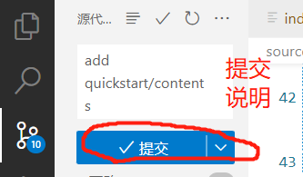
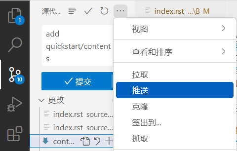

# 快速开始

## 1 简介
* 这是xxx-xxx-xxx的共享文档页面，仓库地址在位[这里](https://github.com/ChenWEIx2/XXX-XXX-XXX-Share-Document.git)，页面地址在[这里](https://xxx-xxx-xxx-share-document.readthedocs.io/en/latest/)。
* 页面基于GitHub Page和Sphinx搭建，参考[这里](https://luhuadong.blog.csdn.net/article/details/109006380?spm=1001.2101.3001.6661.1&utm_medium=distribute.pc_relevant_t0.none-task-blog-2%7Edefault%7ECTRLIST%7ERate-1.pc_relevant_antiscan&depth_1-utm_source=distribute.pc_relevant_t0.none-task-blog-2%7Edefault%7ECTRLIST%7ERate-1.pc_relevant_antiscan&utm_relevant_index=1)
* 文档的撰写格式采用[Markdown](https://markdown.com.cn/basic-syntax/)格式。
* 此页面用于组员间共享笔记、论文阅读文档等资料。

## 2 环境配置
### 2.1 克隆仓库到本地

* 下载[Git](https://www.liaoxuefeng.com/wiki/896043488029600/896067074338496)并安装，并完成个人账户设置。
* 打开终端，输入下命令，克隆仓库到本地。
​```
    git clone https://github.com/ChenWEIx2/XXX-XXX-XXX-Share-Document.git    
​```


### 2.2 撰写工具
支持markdown和版本管理的平台都能为文本撰写和远程推送带来方便，此处以[VS Code](https://code.visualstudio.com/)为例。
* [下载地址](https://code.visualstudio.com/)。
* 登录Github账号。点击左下角图标，选择“同步设置”。


* 下载Markdown Preview Enhanced插件，便于在撰写文档时即时预览效果。
安装完成后，在VS Code中 打开markdown文档时，点击右侧按钮，即可实现即时预览。




## 3 文档撰写

### 3.1 仓库目录解析
仓库中，与个人撰写文档相关的文件如下：
```python
    source
    ├─Document                # 全部文档的存放位置
    │  ├─A                    # 成员A的文件夹
    │  │  ├─document          # 存放文档的总路径
    │  │  │   ├─img           # 存放markdown文档中插入的图片
    │  │  │   ├─paper1.md     # 文档1
    │  │  │   └─paper2.md     # 文档2
    │  │  └─index.rst         # 文档在网页中显示的索引文件
    │  │ 
    │  └─B                    # 成员B的文件夹，内容同A
    │ 
    ├─Quick_start             # 存放此页面的向导文档的文件夹，形式同上
    ├─conf.py                 # 设置网页格式的python文件
    └─index.rst               # 页面总索引
```

### 3.2 撰写方法
* 新建存放个人文档的文件夹。可复制Document文件夹下的模板A文件夹，并改名，此处以命名为B举例。
* 将新建文件夹添加到网页索引栏。在Document\index.rst末尾添加索引路径（添加时注意缩进，下同）。

* 修改个人文件夹在网页索引栏的显示名称。第一步新建文件夹下的index.rst文件的第一行即为索引的显示名称。
* 撰写个人文档并添加到索引。撰写好的个人文档（如模板A中的paper1.md等文件）放到对应文件夹下的document路径下。接着将文档路径添加到个人文件夹下的index.rst文件，便于在网页显示。


### 3.3 远程同步与推送
* 点击VS Code侧边栏的树杈图标，进入版本管理。

* git pull。本地仓库要经常与远程仓库同步，才不易出现版本冲突的问题。点击上方的“···”，再点击“拉取”，即可将远程仓库与本地同步，相当于进行了git pull操作。

* git add。点击新增或修改过的文件旁边的“+”，将文件添加到暂存区中，相当于进行了git add操作。

* git commit。在上方的空白框中输入提交说明（说明要尽量简短，指出新添加文档名字即可），点击上方的提交，表示进行了一次版本跟新，相当于进行了git commit操作。

* git push。点击上方的“···”，再点击“推送”，即可将文档发布到远程，相当于进行了git push操作。
